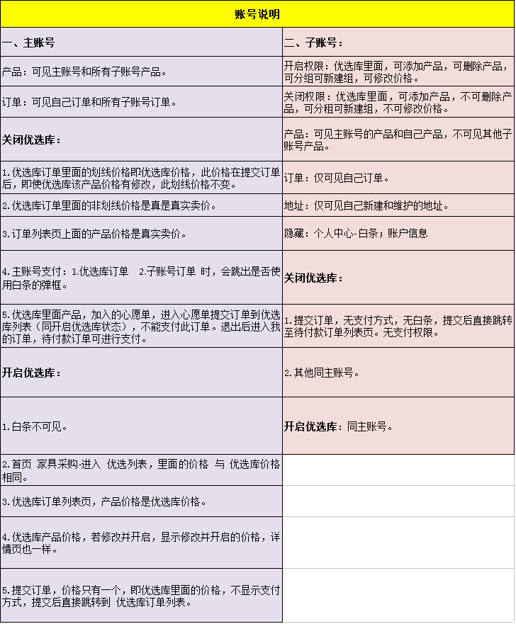

# Retrofit2RxjavaDemo
## 中文版

近期更新了错误处理方面，更加全面地处理了http的错误和服务返回的错误类型，并直接向用户提示。
增加了请求时的进度对话框等，由于上班，有时间来补上这边。英语版也需要重新编写了。



## English Version
[please click here to see english version.](language/README-EN.md)
To explain how to retrieve data from non restful response to get the right data.

If you want to retrieve information like below, which is non restful data response, then you can combine Rxjava to decompose the result and get the real part you wanted.

The main method is encapsulate Retrofit2 and retrieve data with Rxjava.

```java   
	{

	“code”:803,

	"msg":"该用户没有注册"

	“result”：{

                //balababla

                }

	}
```

----------

the main part is error check, pass in the raw data json, then use transformer, to transform out the real part!

一定是有code状态码和返回信息的，我之前的用法和教程一样，说将服务器返回的结果复制下来直接在AS上面利用GsonFormat转化就OK了，确实很方便，但是这样下来每个bean里面都会有重复的erroe_code和message或者服务器返回其他，所以我是这样做的：


----------

使用方法：
1.配置对应的外层实体，例如下面
```java
	{
		private int count;
	    private int start;
	    private int total;
	    private String title;
	
	    //用来模仿Data
	    @SerializedName(value = "subjects")
	    private T data;
	}
```
其中的T就是泛型

2.同Retrofit2一样要定义接口，如下

```java
	@GET("top250")
    Observable<HttpResult<List<ContentBean>>> getTopMovie(@Query("start") int start, @Query("count") int count);
```
3.使用ServiceFactory
```java
	MovieService newService = ServiceFactory.createOauthService(MovieService.class);
        newService.getTopMovie(0, 10)
	//                .subscribeOn(Schedulers.io())
	//                .observeOn(AndroidSchedulers.mainThread())
	//                .compose(new ErrorCheckTransformer<List<ContentBean>>())
                .compose(new DefaultTransformer<List<ContentBean>>())
                .subscribe(new Observer<List<ContentBean>>() {
                    @Override
                    public void onCompleted() {
                        Toast.makeText(MainActivity.this, "Completed!", Toast.LENGTH_SHORT).show();
                    }

                    @Override
                    public void onError(Throwable e) {
                        Toast.makeText(MainActivity.this, "Error!", Toast.LENGTH_SHORT).show();
                    }

                    @Override
                    public void onNext(List<ContentBean> subjects) {
                        Toast.makeText(MainActivity.this, "onNext", Toast.LENGTH_SHORT).show();
                        resultTV.setText("begin >>>>>>>>>>>>>>>>." + subjects.toString());
                    }
                });
```

##Thanks
- [Android基于Retrofit2.0 封装的超好用的RetrofitClient工具类]( http://www.jianshu.com/p/29c2a9ac5abf)
- [Retrofit2.0 再次封装：](http://www.jianshu.com/p/7edc1cce6b93)
- [Retrofit + RxAndroid 实践总结](http://www.jianshu.com/p/f48f6d31314b)
- [RxJava 与 Retrofit 结合的最佳实践]( https://gank.io/post/56e80c2c677659311bed9841)
- [你真的会用Retrofit2吗?Retrofit2完全教程](http://www.jianshu.com/p/308f3c54abdd)

##Contact Me
- Github:   github.com/ysmintor
- Email:    ysmintor@gmail.com
- Linkedin: cn.linkedin.com/in/ysmintor


##License

    Copyright 2016 YorkYu. All rights reserved.

    Licensed under the Apache License, Version 2.0 (the "License");
    you may not use this file except in compliance with the License.
    You may obtain a copy of the License at

        http://www.apache.org/licenses/LICENSE-2.0

    Unless required by applicable law or agreed to in writing, software
    distributed under the License is distributed on an "AS IS" BASIS,
    WITHOUT WARRANTIES OR CONDITIONS OF ANY KIND, either express or implied.
    See the License for the specific language governing permissions and
    limitations under the License.
