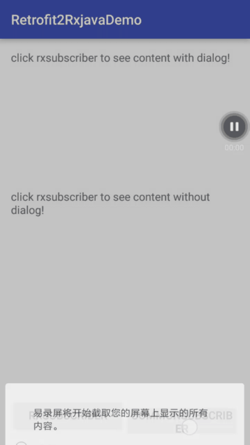
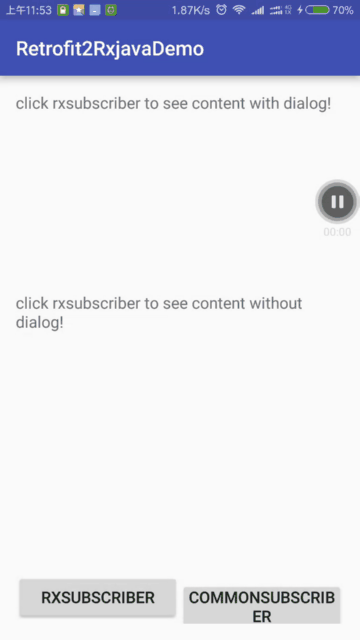

# Retrofit2RxjavaDemo
[](https://travis-ci.org/ysmintor/Retrofit2RxjavaDemo)
***


## 中文版


### 效果展示




本文主要介绍了使用Retrofit2配合Rxjava[这里指Rxjava1, 暂时未适配Rxjava2] 来处理非restful的网络请求结果。一般而言请求的非REST结果如下,包括一个code代表结果的状态和msg表示描述，以及data对应的真实的数据。我们的目的就是直接取`data`对应的数据，如果是数组那么取的也是数组`list<databean>`类型的，如果有错误，那么就会调用onError()方法。更多演示效果请查看video目录下的视频。

```json
{
	"code": 0,    //请求返回状态码 0表示成功，其它则为对应的错误类型
	"msg": "请求成功",    //请求返回状态
	"data":
	{    //返回结果
			"phone": "010-62770334;010-62782051",    //电话
			"website": "www.tsinghua.edu.cn",    //官网
			"email": "zsb@mail.tsinghua.edu.cn",    //邮箱
			"address": "北京市海淀区清华大学",    //地址
			"zipcode": "0102770334",    //邮编
			"name": "清华大学",    //学校名称
			"img": "http://img.jidichong.com/school/3.png",    //学校logo图片
			"parent": "教育部",    //隶属部门
			"type": " 211 985",    //学校类型
			"profile": "xasd",   //简介
			"info": "院士：68人 博士点：198个 硕士点：181个",    //说明
			"city": "北京"   //所在省市
	}
}
```

而Retrofit2 请求的结果一般都分为Header 和Body。在获取这些数据后再在Rxjava subscriber 中的onNext()来处理比较麻烦。所以这个demo介绍了如何结果Retrofit2与Rxjava1来处理数据并在成功时得到data字段的数据，服务端返回有错误是进入onError(),当是单个实体的时候，在onNext中就直接得到这个结果，如果是一个数组的时候，则是返回List<Entity> 这种形式。同时也简化了定义gson实体不用每次都加code， msg这样一层。


----------

使用方法：

### 1. 配置对应的外层实体。

例如下面。开发中一般都非标准的REST都是一个数据(百度开放平台的接口就基本都是这种形式)，一个状态码和一个消息。其中data的类型是泛型，可以在生成请求的api指定实际返回的类型，如果为空的情况可以使用String。 而code 和message是对应于服务端定义的代码code和返回的错误信息。如果你的后台后台字段不同，你可以按需要修改这个HttpResult的相应字段。

```java
	{
			  // code 为返回的状态码, message 为返回的消息, 演示的没有这两个字段，考虑到真实的环境中基本包含就在这里写定值
		    private int code = 0;
				private String message = "OK";

		    //用来模仿Data
		    @SerializedName(value = "subjects")
		    private T data;
	}
```

### 2. 同Retrofit2一样要定义接口。
如下。这里仅仅是有GET的接口在demo里，POST, PUT, DELETE, QUERY等都是一样的。`HttpResult`里T的类型就是指定泛型data的具体类型。可以使用String， JSONObject，定义的实体等等。

另外有朋友问题访问参数是JSON对象怎么办 _(Body Paramter JSON Object)_？这其实就是将你的参数设置成一个已经定义的实体，我也给出一个项目中的接口。下面的post就是这种方式。关于请求的REST方式我会在文章后面放出详细的参考，若你不熟悉请参考这些文章。
```java

@GET("mock3")
Observable<HttpResult<MockBean>> getMock3();

@GET("mock1")
Observable<HttpResult<List<MockBean>>> getMock1();

@GET("mock4")
Observable<HttpResult<MockBean>> getMock4();

@GET("mock2")
Observable<HttpResult<MockBean>> getMock2();
```

### 3. 请求网络。

直接调用
```java
public static MockApi mockApi() {
		return ServiceFactory.createService(MockApi.class);
}
```

使用一个默认的`.compose(new DefaultTransformer<List<MockBean>>())`可以非常方便地进行转化成了需要的`Observable`。如下代码中那样进行了线程的转换，错误的处理在这个transformer，可以自定义自己的transformer。
```java
return observable
              .subscribeOn(Schedulers.io())
              .observeOn(Schedulers.newThread())
              .compose(ErrorTransformer.<T>getInstance())
              .observeOn(AndroidSchedulers.mainThread());
```

另外准备了常用的subscriber，包含了网络连接的错误处理，例如非200状态，另外是服务端（业务）错误的处理，默认是将错误编码和错误信息在控制台和手机上输出。
提供的`RxSubscriber`和 `CommonScriber`中的`onNext()`必须实现。

建议使用`RxLifecycle`防止使用`RxJava`内存泄露。其它方面使用同RxJava与Retrofit2结合的使用是相同的，所以得到结果您若有若要对数据进行处理仍然是链式调用。

---

# 关于错误处理方面介绍

主要使用了RxJava中的`onErrorResumeNext`，遇到错误后将错误通过`ExceptionEngine.handleException(throwable)`进行处理。

```java
@Override
public Observable<T> call(Observable<HttpResult<T>> responseObservable) {
    return responseObservable.map(new Func1<HttpResult<T>, T>() {
        @Override
        public T call(HttpResult<T> httpResult) {
            // 通过对返回码进行业务判断决定是返回错误还是正常取数据
            if (httpResult.getCode() != ErrorType.SUCCESS) throw new ServerException(httpResult.getMessage(), httpResult.getCode());
            return httpResult.getData();
        }
    }).onErrorResumeNext(new Func1<Throwable, Observable<? extends T>>() {
        @Override
        public Observable<? extends T> call(Throwable throwable) {
            //ExceptionEngine为处理异常的驱动器
            throwable.printStackTrace();
            return Observable.error(ExceptionEngine.handleException(throwable));
        }
    });
}
```
其中的ApiException包括code和错误的详情
```java
public class ApiException extends Exception {
    // 异常处理，为速度，不必要设置getter和setter
    public int code;
    public String message;

    public ApiException(Throwable throwable, int code) {
        super(throwable);
        this.code = code;
    }
}
```

__重点在于下面这个处理。你可以再定义自己的业务相关的错误，目前常用的都已经有了，而业相关的错误大部分通过接收的数据直接显示了。若不是直接显示的情况，你完全可以在提供的subscriber里去实现。__
```java
public class ExceptionEngine {
    //对应HTTP的状态码
    private static final int UNAUTHORIZED = 401;
    private static final int FORBIDDEN = 403;
    private static final int NOT_FOUND = 404;
    private static final int REQUEST_TIMEOUT = 408;
    private static final int INTERNAL_SERVER_ERROR = 500;
    private static final int BAD_GATEWAY = 502;
    private static final int SERVICE_UNAVAILABLE = 503;
    private static final int GATEWAY_TIMEOUT = 504;

    public static ApiException handleException(Throwable e){
        ApiException ex;
        if (e instanceof HttpException){             //HTTP错误
            HttpException httpException = (HttpException) e;
            ex = new ApiException(e, ErrorType.HTTP_ERROR);
            switch(httpException.code()){
                case UNAUTHORIZED:
                    ex.message = "当前请求需要用户验证";
                    break;
                case FORBIDDEN:
                    ex.message = "服务器已经理解请求，但是拒绝执行它";
                    break;
                case NOT_FOUND:
                    ex.message = "服务器异常，请稍后再试";
                    break;
                case REQUEST_TIMEOUT:
                    ex.message = "请求超时";
                    break;
                case GATEWAY_TIMEOUT:
                    ex.message = "作为网关或者代理工作的服务器尝试执行请求时，未能及时从上游服务器（URI标识出的服务器，例如HTTP、FTP、LDAP）或者辅助服务器（例如DNS）收到响应";
                    break;
                case INTERNAL_SERVER_ERROR:
                    ex.message = "服务器遇到了一个未曾预料的状况，导致了它无法完成对请求的处理";
                    break;
                case BAD_GATEWAY:
                    ex.message = "作为网关或者代理工作的服务器尝试执行请求时，从上游服务器接收到无效的响应";
                    break;
                case SERVICE_UNAVAILABLE:
                    ex.message = "由于临时的服务器维护或者过载，服务器当前无法处理请求";
                    break;
                default:
                    ex.message = "网络错误";  //其它均视为网络错误
                    break;
            }
            return ex;
        } else if (e instanceof ServerException){    //服务器返回的错误
            ServerException resultException = (ServerException) e;
            ex = new ApiException(resultException, resultException.code);
            ex.message = resultException.message;
            return ex;
        } else if (e instanceof JsonParseException
                || e instanceof JSONException
                || e instanceof ParseException){
            ex = new ApiException(e, ErrorType.PARSE_ERROR);
            ex.message = "解析错误";            //均视为解析错误
            return ex;
        }else if(e instanceof ConnectException || e instanceof SocketTimeoutException || e instanceof ConnectTimeoutException){
            ex = new ApiException(e, ErrorType.NETWORD_ERROR);
            ex.message = "连接失败";  //均视为网络错误
            return ex;
        }
        else {
            ex = new ApiException(e, ErrorType.UNKNOWN);
            ex.message = "未知错误";          //未知错误
            return ex;
        }
    }
}
```

关于处理服务器在错误时将错误信息直接放在data字段，即data字段在结果成功和失败对应的类型不定。处理思路是自定义GsonConverter，可以查看Demo里的`MockDataActivity`去看使用方法，其实就修改Retofit2初始化传入的GsonConverter。关键是对于`CustomGsonResponseBodyConverter`的修改。
```java
@Override
public T convert(ResponseBody value) throws IOException {
    String response = value.string();
    JsonElement jsonElement = jsonParser.parse(response);
    int parseCode = jsonElement.getAsJsonObject().get("code").getAsInt();
    //
    if (parseCode != ErrorType.SUCCESS) {
        value.close();
        String msg = jsonElement.getAsJsonObject().get("data").getAsString();
        throw new ServerException(msg, parseCode);
    } else {

        MediaType contentType = value.contentType();
        Charset charset = contentType != null ? contentType.charset(UTF_8) : UTF_8;
        InputStream inputStream = new ByteArrayInputStream(response.getBytes());
        Reader reader = new InputStreamReader(inputStream, charset);
        JsonReader jsonReader = gson.newJsonReader(reader);

        try {
            return adapter.read(jsonReader);
        } finally {
            value.close();
        }
    }
}
```

这里先解析code字段再进行判断，所以处理这种服务器返回的话，是需要将上面的`"code"`和`"data"`替换成你服务端具体的字段。


-------------------


## Update
### 2017-03-27
更新文档，增加短视频说明，增加错误信息放在data字段的说明。
### 2017-03-07

添加处理非REST接口在token失效时或code异常时，错误信息放在data字段的解析办法处理。

```json
 {
		code:-1
		data:"token失效"
 }
```
```json
{
		code:0
		data:{name:"xiaoming", age:23}
}
```

针对上面的JSON都要在同一个接口里处理，解决办法都是两次解析的办法，第一次取到code并且判断，不是期望的值进行处理。期望的值可按原路处理。这里采用了修改GsonConverter的办法。

--------------------

### 2016-12-26
	解决了执行onCompleted()之后执行onError()的问题
```java
if (!isUnsubscribed())
{
		unsubscribe();
}
```


-----------------


### 2016-10-13

修正了服务端code没有处理，返回为错误时认为是json实体解析问题。

``` java
if (httpResult.getCode() != ErrorType.SUCCESS || httpResult.getCode() != ErrorType.SUCCESS)
```


## Thanks
- [Retrofit自定义GsonConverter处理请求错误异常处理](http://blog.csdn.net/jdsjlzx/article/details/52145131)
- [你真的会用Retrofit2吗?Retrofit2完全教程](http://www.jianshu.com/p/308f3c54abdd)
- [Error handling in RxJava](http://blog.danlew.net/2015/12/08/error-handling-in-rxjava/)
- [Android基于Retrofit2.0 封装的超好用的RetrofitClient工具类]( http://www.jianshu.com/p/29c2a9ac5abf)
- [Retrofit2.0 再次封装：](http://www.jianshu.com/p/7edc1cce6b93)
- [Retrofit + RxAndroid 实践总结](http://www.jianshu.com/p/f48f6d31314b)
- [RxJava 与 Retrofit 结合的最佳实践]( https://gank.io/post/56e80c2c677659311bed9841)
- [你真的会用Retrofit2吗?Retrofit2完全教程](http://www.jianshu.com/p/308f3c54abdd)

## Contact Me
- Github:   github.com/ysmintor
- Email:    ysmintor@gmail.com


## License

    Copyright 2016 YorkYu. All rights reserved.

    Licensed under the Apache License, Version 2.0 (the "License");
    you may not use this file except in compliance with the License.
    You may obtain a copy of the License at

        http://www.apache.org/licenses/LICENSE-2.0

    Unless required by applicable law or agreed to in writing, software
    distributed under the License is distributed on an "AS IS" BASIS,
    WITHOUT WARRANTIES OR CONDITIONS OF ANY KIND, either express or implied.
    See the License for the specific language governing permissions and
    limitations under the License.
